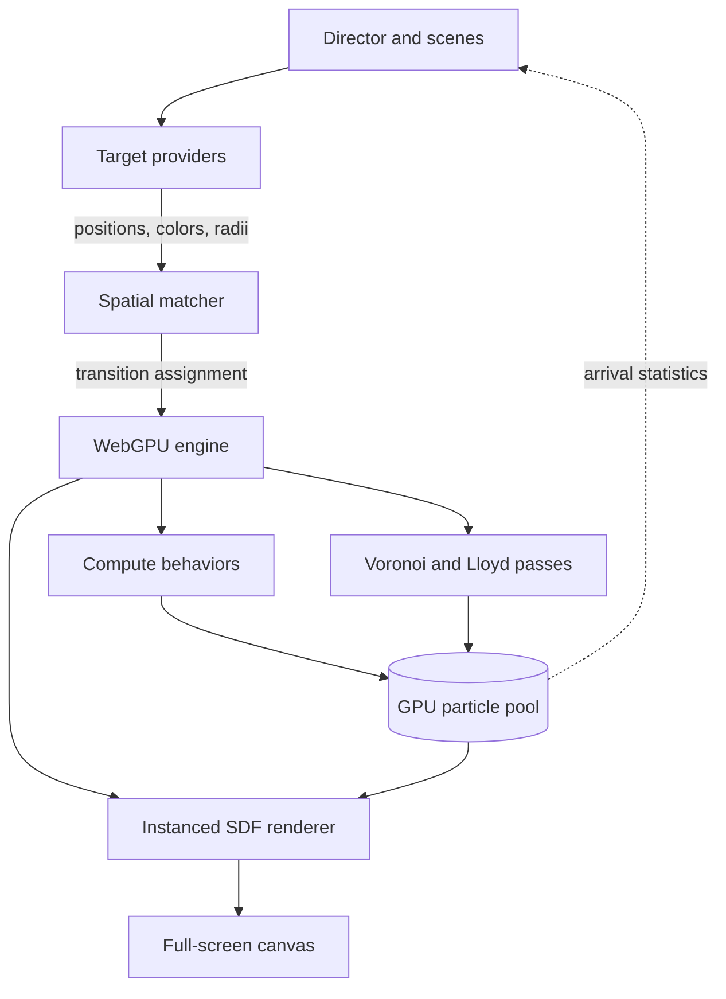

# fbonc.com

My website, built around a custom WebGPU particle engine that turns page content and images into a single, continuous field of motion.

The site is both an introduction to my work and a graphics project in its own right. Text assembles from particles, interface states flow into one another, and images emerge through real-time Voronoi stippling, all from one GPU-resident particle pool.

[Visit fbonc.com](https://fbonc.com)

## The WebGPU particle engine

The visual system is not a collection of separate effects. It is one engine with one persistent particle pool. Each scene changes what the particles represent, how they are assigned, and which behavior controls them; the underlying simulation and rendering pipeline stays the same.

That design lets a particle move naturally from an ambient orbit into a line of text, leave that text during a transition, and later become part of a stippled image. Position, velocity, color, radius, cohort, and behavior state remain on the GPU throughout.



### ParticlePool

`ParticlePool` is the engine's single source of truth. It uses fixed-capacity WebGPU storage buffers rather than JavaScript objects or per-frame buffer uploads. A particle stores its current and target position, velocity, radius, packed color, cohort, and a small scratch region used by its active behavior.

Particles are divided into cohorts such as ambient, text, stipple, and dead. Different cohorts can run different behaviors in the same compute dispatch, which means one part of the composition can settle into text while another continues to orbit or disperse.

Dead particles shrink to zero-radius instances and their slots are recycled on the next assignment. The pool does not need to be compacted during animation.

### GPU-driven motion

Motion is implemented as composable WGSL behaviors:

- **Seek** accelerates toward a target and snaps cleanly on arrival.
- **Orbit** creates the breathing, rippling idle formation used by the intro.
- **Explode** applies a radial impulse with controlled decay.
- **Relax** follows the continuously moving centroids produced by the stipple pipeline.

All simulation is delta-time integrated, so animation speed is independent of the display refresh rate. After each behavior step, a shared compute stage updates color and radius from journey progress. Because interpolation is tied to spatial progress instead of elapsed time, every particle reaches its exact target appearance when it lands.

Before a transition, both particles and targets are ordered by Morton code. Matching by spatial rank preserves locality: nearby particles tend to receive nearby destinations. The result is a legible, flowing morph instead of the visual noise produced by random assignment.

Matching happens only when a scene requests a new target set. The completed assignment is uploaded once; the GPU handles the transition from that point forward.

### Real-time Voronoi stippling

Images are represented through point density rather than textured geometry. Darker or more visually important regions receive more particles, and the image develops on screen as those particles relax toward an even distribution.

The stipple pipeline works in two stages:

1. The image is decoded into a luminance density map. Density-weighted rejection sampling produces the initial particle targets.
2. WebGPU repeatedly builds a Voronoi diagram and moves every point toward its density-weighted cell centroid. This is Lloyd relaxation, performed live as part of the animation.

```text
density texture
      │
      ▼
seed splat ──▶ jump flooding ──▶ Voronoi ownership
                                        │
                                        ▼
particle targets ◀── centroid pass ◀── weighted accumulation
        │
        └──────── relax behavior ───────▶ next frame
```

The Voronoi field is generated with the Jump Flooding Algorithm in a small sequence of compute passes. Centroid accumulation uses fixed-point integer atomics, avoiding unsupported floating-point atomics while preserving weighted sums. The resulting centroid buffer becomes the live target source for the `relax` behavior.

### Rendering

Every visible particle is rendered in one instanced draw. The vertex shader reads particle state directly from storage using `instance_index` and expands each instance into a screen-aligned quad. The fragment shader evaluates a signed-distance circle with a soft edge, giving the particles a clean silhouette without circle meshes or per-particle draw calls.

The canvas is device-pixel-ratio aware and uses premultiplied alpha so the particle layer integrates cleanly with the page beneath it.

## How a frame works

The CPU controls intent; the GPU controls motion.

1. The Director advances the current scene and writes any scene or behavior parameters.
2. Compute shaders update every active particle according to its cohort.
3. The shared post-step resolves progress-based color and radius changes and records arrival counts.
4. When stippling is active, the Lloyd module periodically refreshes the particles' centroid targets.
5. A single render pass draws the entire alive pool.
6. Only a tiny asynchronous statistics buffer returns to the CPU, allowing the Director to advance when particles have actually arrived rather than after an arbitrary timer.

There is no per-frame CPU-to-GPU particle-state transfer and no per-particle JavaScript animation loop.

## Scene direction

The Director is an explicit state machine that sequences the portfolio experience:

- **IntroOrbit** gathers the particles into the breathing formation shown on entry.
- **TextMorph** captures real HTML, samples it into targets, and moves the shared pool between the biography, projects, and other page states.
- **StippleCycle** gathers particles into an image, runs visible Lloyd relaxation, holds the finished composition, and selects the transition into the next image.

Scenes describe state and transitions rather than owning render loops. Completion is driven by arrival statistics from the GPU, so scene timing follows the animation's real state.

## The website around the engine

The graphics are designed to support the portfolio rather than replace it. The page retains semantic HTML for biography, project navigation, résumé, and external links. During a text transition, that HTML is rasterized into particle targets; once the movement completes, the actual DOM content takes over so links remain selectable, accessible, and sharp at every display scale.

Input from clicks and the keyboard is routed through the Director. Responsive target regeneration keeps text and particle layouts aligned after a resize. On browsers without WebGPU, the animation layer is skipped and the static HTML portfolio remains available.

## Architecture boundaries

The engine is split into small systems with narrow contracts:

| System | Responsibility |
| --- | --- |
| **Director** | Owns page flow, scene phases, and input-driven transitions |
| **Target providers** | Convert HTML or image density into typed position, color, and radius arrays |
| **Matcher** | Produces spatially coherent particle-to-target assignments |
| **Particle pool** | Owns persistent GPU state, slot reuse, cohorts, and arrival statistics |
| **Behaviors** | Update motion in WGSL compute passes |
| **Lloyd module** | Builds the Voronoi field and density-weighted centroid targets |
| **Renderer** | Draws the pool as instanced signed-distance circles |

These boundaries keep the system extensible. A new motion style is a behavior module, a new kind of visual source is a target provider, and a new page sequence is a scene. Each plugs into the same pool and renderer.

## Technology

- TypeScript
- WebGPU and WGSL
- Vite
- Tailwind CSS
- `html2canvas-pro` for DOM target capture

## Further reading

The repository includes focused notes on the engine's major systems:

- [Architecture overview](docs/02_webgpu-architecture.md)
- [Particle pool](docs/webgpu-architecture/01_particle-pool.md)
- [Compute behaviors](docs/webgpu-architecture/02_behaviors.md)
- [Voronoi stipple pipeline](docs/webgpu-architecture/03_stipple-pipeline.md)
- [Rendering](docs/webgpu-architecture/04_rendering.md)
- [Director and scenes](docs/webgpu-architecture/05_director-scenes.md)
- [Extension points](docs/webgpu-architecture/zz_extension-points.md)

---

Designed and built by [Felipe Bonchristiano](https://github.com/fbonc).
