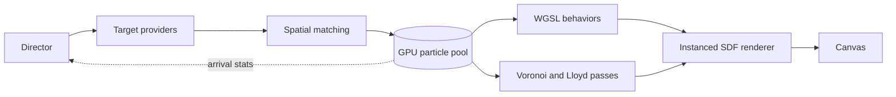

# fbonc.com

My website, built around a custom WebGPU particle engine that turns page content and images into a continuous field of motion.

Text assembles from particles, interface states flow into one another, and images emerge through real-time Voronoi stippling. The result is both a personal portfolio and an interactive graphics project.

[Visit fbonc.com](https://fbonc.com)

## WebGPU particle engine

The visual system is one engine with one persistent, GPU-resident particle pool. Instead of treating the intro, text transitions, and stippled images as separate effects, the engine changes what the same particles represent and how they behave. A particle can move from an ambient orbit into a line of text, disperse during a transition, and later become part of an image without its state ever leaving the GPU.

The pool stores every particle's position, velocity, target, radius, color, cohort, and behavior state in fixed-capacity WebGPU storage buffers. Cohorts allow text particles to seek while ambient particles orbit and image particles relax, all within the same compute dispatch. Unused particles shrink to zero radius and their slots are recycled, avoiding compaction during animation.

Motion comes from composable WGSL behaviors: **seek** accelerates toward a target, **orbit** produces the breathing intro formation, **explode** applies a decaying radial impulse, and **relax** follows the moving centroids of the stipple simulation. The simulation is delta-time integrated, so its speed is independent of refresh rate. Color and radius are interpolated from journey progress, ensuring that each particle lands with exactly the intended appearance.

Transitions use Morton-order matching. Particles and targets are sorted spatially before assignment, so nearby particles tend to receive nearby destinations. This preserves the shape of the moving field and produces coherent morphs instead of the noise of random matching. Assignments are uploaded once per transition; there is no per-frame CPU-to-GPU particle-state transfer.

## From images to stipples

The image sequence uses weighted centroidal Voronoi tessellation to represent detail through particle density rather than textured geometry.

An image is first converted into a luminance density map, then density-weighted rejection sampling generates the initial particle positions. From there, WebGPU performs the relaxation live: particles are splatted into a seed texture, the Jump Flooding Algorithm constructs Voronoi ownership, and compute passes accumulate each cell's density-weighted centroid. Because WebGPU atomics are integer-only, the accumulation uses fixed-point integer values before a final pass writes the new targets.

The `relax` behavior follows those continuously updated centroids, allowing the image to visibly settle into an even, blue-noise-like distribution. The entire cycle—from gathering into an image through relaxation, hold, and departure—is coordinated by the same scene system used for text.

Rendering remains simple: one instanced draw covers the alive particle pool. The vertex shader reads particle state directly from storage and expands each instance into a screen-aligned quad; the fragment shader evaluates a soft-edged signed-distance circle. This avoids per-particle draw calls and keeps simulation and rendering on the GPU.

## Portfolio experience

An explicit Director state machine connects the graphics engine to the website. `IntroOrbit` controls the entry formation, `TextMorph` moves particles between captured HTML sections, and `StippleCycle` sequences the image animations. Scene changes use asynchronous arrival statistics from the GPU, so the experience advances when particles have actually settled rather than after arbitrary timers.

The particle layer complements semantic HTML instead of replacing it. Page content is temporarily rasterized into targets during a morph, then the real DOM takes over once the transition finishes, keeping text sharp and links accessible. Resizing regenerates targets for the new layout, while browsers without WebGPU receive the static portfolio without the animation layer.

**Built with:** TypeScript, WebGPU, WGSL, Vite, Tailwind CSS, and `html2canvas-pro`.
